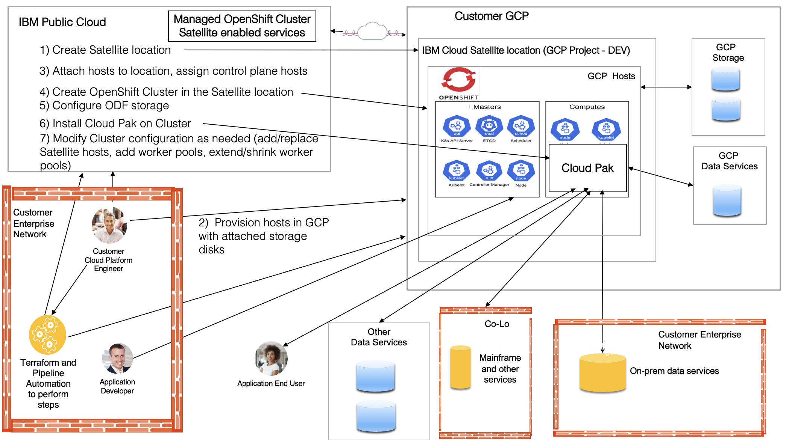

# This forked repo has been heavily modified to fix bugs and work with Day 2 activities

The documentation below is no longer valid for this fork.  This has been refactored to use resources
instead of the modules in some places.  The variables file has been formatted to deal with adding/removing hosts easily
without destruction of other hosts

# satellite-google

Use this terrafrom automation to set up satellite location on IBM cloud with Google host.

This example cover end-to-end functionality of IBM cloud satellite by creating satellite location on specified zone.
It will provision Google hosts and assign the control plane hosts it setup to the Satellite location control plane.

## Some of the bugs fixed and features added to support Day 2 operations 

* Allows for Day2 operations (adding/removing hosts in any order from environment variables)
* Fixed bugs with Satellite COS backup location
* Removed Terraform dependency on the host’s attach_script, refactored to use Resources, and fixed issue with attach_script host labels)
* Fixed numerous bugs with GCP conventions (unique disk names per zone, zone round robin logic, support custom image)
* Supports separate subnets for worker/master nodes inside GCP
* Supports multiple locations across different regions for running hot/hot clusters (for Production)
* Supports private clusters with no public IPs (this deployment zone resides in a locked down area)

## Deploying a Cloud Pak on OpenShift in GCP using IBM Cloud Satellite 

